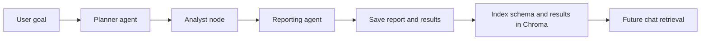

# ETERNAL

**Upload a dataset. Ask questions in plain English. Get a grounded analysis, real charts, and a cleaned-up CSV — no invented numbers.**

🔗 **Live app:** [eternalu.web.app](https://eternalu.web.app/)

[](#technology-stack)
[](#technology-stack)
[](#analysis-pipeline)
[](#technology-stack)
[](#docker-compose)
[](#license)

## TL;DR

ETERNAL is a full-stack data exploration workspace: upload a tabular file, inspect its schema, chat with it, request charts, run an agent-generated analysis, and approve or skip data-cleaning steps — all from one React interface.

The core design rule: **the LLM plans and explains, pandas computes.** The model never invents a number — it only ever produces a structured plan that gets executed against the real dataframe. That single decision is what keeps the reports and charts trustworthy.

## Why this project is useful

- **Understand a new dataset quickly** — schema detection reports row/column counts, dtypes, missing values, unique values, and basic numeric statistics.
- **Ask focused questions** — chat retrieves over the dataset schema and saved analysis results, so answers stay grounded in the current dataset.
- **Run repeatable analysis** — a planner produces a structured plan, an analyst executes only supported pandas operations, and a reporter turns the real results into a Markdown report.
- **See patterns visually** — natural-language chart requests become chart specifications; the data behind every chart is computed from the dataframe, not guessed.
- **Prepare data with approval** — the feature-engineering planner proposes changes and the user keeps or skips each one before the CSV is touched.
- **Resume work** — dataset metadata, uploaded files, and vector indexes persist across sessions when Docker volumes are used.

## Analysis pipeline



- The **Planner** asks the LLM for a JSON plan containing 3 to 6 supported steps.
- The **Analyst** loads the actual dataframe and executes each step with pandas.
- The **Reporter** receives computed results and writes a four-section Markdown report.
- Results are cached and indexed so reopening a dataset does not require an immediate re-analysis.

Supported analysis steps: `missing_report`, `describe`, `value_counts`, `correlation`, `groupby_mean`.

## Current capabilities

### Dataset ingestion

The backend accepts CSV, TSV, XLSX, XLS, JSON, and Parquet files, and can convert table-like PDF, DOCX, and delimited TXT files into CSV before loading them. Uploads are capped at 50 MB.

The browser upload screen currently filters the file picker to CSV, XLSX, and XLS. Wider format support is available through the API and Swagger UI.

### Dataset overview

After upload, the overview screen shows row/column counts, total missing values, every column's dtype and unique-value count, numeric min/max/mean, saved reports, generated charts, and the strongest correlation found.

### Natural-language chat

The chat endpoint handles normal questions, analysis requests, chart requests, and cleaning requests. Normal questions use Chroma retrieval plus the configured LLM provider; analysis requests invoke LangGraph; chart and cleaning requests produce approval cards in the UI.

The paperclip menu can set an explicit mode — **Clean / Modify Data**, **Analysis**, or **Plots & Graphs** — otherwise the backend detects likely intent from the message text.

### Feature engineering

| Step type | Required fields | Behavior |
|---|---|---|
| `fillna` | `column`, `strategy` | Fill with `mean`, `median`, `mode`, or `constant`; constants may also provide `value`. |
| `drop_column` | `column` | Remove a column. |
| `encode_categorical` | `column`, `method` | Use `onehot` or `label` encoding. |
| `log_transform` | `column` | Apply `log1p` after clipping negative values to zero. |
| `bin_numeric` | `column`, `new_column`, `bins` | Add a pandas categorical bin column. |
| `create_ratio` | `new_column`, `numerator`, `denominator` | Add a ratio column; zero denominators become missing. |

Applying a plan overwrites the dataset's CSV in place. The dataset ID is retained, but the old report is marked dirty and must be regenerated.

## Architecture

```text
frontend/                 React + Vite client
  src/api.js              HTTP client and device ID handling
  src/screens/            Home, overview, CSV, chat, cleaning screens
  src/components/         Sidebar, charts, chart modal

backend/app/
  main.py                 FastAPI application and router registration
  routers/                Upload, chat, analysis, and feature-engineering APIs
  agents/                 LangGraph nodes and chart/cleaning planners
  core/                   Loading, schema, registry, vector store, charts, history
  services/llm_service.py Provider interface and Groq implementation
backend/app_data/         JSON dataset metadata index
backend/uploads/          Uploaded files
backend/vector_store/     Chroma persistence
backend/tests/            Backend tests
```

The backend has two kinds of state:

- Live file context and chat history are held in process memory.
- Dataset metadata is persisted as JSON, and Chroma data is persisted on disk.

Because the live registry is in memory, a backend restart can make existing dataset IDs unavailable to API operations even though their files and metadata remain on disk. For production, move the registry and file lifecycle to a shared database/object store.

## Technology stack

<details>
<summary><strong>Frontend</strong></summary>

| Technology | How ETERNAL uses it |
|---|---|
| React 19 | Builds the single-page data workspace and its screens. |
| Vite | Provides the frontend development server, proxy, and production build. |
| React Router | Routes between upload, overview, CSV preview, cleaning, and chat screens. |
| Recharts | Renders generated bar, pie, line, scatter, histogram, heatmap, and grouped-bar visualizations. |
| Lucide React | Supplies interface icons and action controls. |
| React Markdown | Renders AI-generated analysis reports and chat responses. |
| Remark GFM | Adds GitHub-flavored Markdown support, including tables. |
| html-to-image | Supports exporting chart visuals as images. |
| Nginx | Serves the compiled frontend in the production container. |

</details>

<details>
<summary><strong>Backend and API</strong></summary>

| Technology | How ETERNAL uses it |
|---|---|
| Python 3.12 | Backend runtime. |
| FastAPI | Defines the HTTP API, request validation, routing, and OpenAPI documentation. |
| Uvicorn | Runs the FastAPI application. |
| Pydantic 2 | Validates JSON request and response models. |
| python-multipart | Handles multipart file uploads. |
| python-dotenv | Loads local environment variables from `backend/.env`. |
| CORS middleware | Allows the browser frontend to call the backend; currently open and should be restricted in production. |

</details>

<details>
<summary><strong>GenAI and agentic AI</strong></summary>

| Technology | How ETERNAL uses it |
|---|---|
| Groq API | Provides the hosted large language model used for chat, planning, reporting, chart planning, and cleaning proposals. |
| Groq Python SDK | Sends structured prompts and conversation history to Groq. |
| LangGraph | Orchestrates the analysis graph: Planner → Analyst → Reporter. |
| Custom provider interface | Keeps LLM integration behind `get_llm_provider()`, allowing another provider to be added later. |
| Prompt-constrained JSON | Makes planner, chart, and feature-engineering proposals structured before execution. |

**LangChain is not currently used.** The project uses LangGraph directly for orchestration and the Groq SDK directly for model calls. CrewAI, PyCaret, scikit-learn, SHAP, and DuckDB are not current dependencies in this repository.

</details>

<details>
<summary><strong>Data processing, file formats, and deployment</strong></summary>

| Technology | How ETERNAL uses it |
|---|---|
| pandas | Loads dataframes, calculates schema statistics, runs analysis steps, and applies cleaning transformations. |
| NumPy | Performs the log transformation used by feature engineering. |
| ChromaDB | Stores and retrieves schema, analysis-result, and report chunks for grounded chat. |
| JSON files | Persist dataset metadata such as filename, dimensions, device ID, and analysis flags. |
| pandas CSV/TSV readers | Reads CSV and tab-separated text files. |
| openpyxl | Reads `.xlsx` Excel files. |
| xlrd (via pandas) | Reads legacy `.xls` Excel files when supported by the installed environment. |
| PyArrow | Reads Parquet files. |
| pdfplumber | Extracts compatible tables from PDF files. |
| python-docx | Extracts compatible tables from DOCX files. |
| Docker / Docker Compose | Packages and runs the backend and frontend as reproducible containers with durable named volumes. |
| Node.js 22 Alpine | Builds the frontend image. |
| Python 3.12 slim | Runs the backend image. |
| Nginx Alpine | Serves the built React application. |

</details>

## Getting started

### Requirements

- Python 3.12 recommended (the backend Dockerfile uses `python:3.12-slim`).
- Node.js and npm for the frontend.
- A Groq API key for chat, planning, reporting, and chart/cleaning proposals.
- Docker and Docker Compose for containerized use.

### Configure the backend

Create `backend/.env`:

```dotenv
GROQ_API_KEY=your_groq_api_key
LLM_PROVIDER=groq
GROQ_MODEL=openai/gpt-oss-120b
DATASET_REGISTRY_PATH=backend/app_data/dataset_index.json
```

Never commit `.env` or API keys. `LLM_PROVIDER` currently supports `groq`; the provider interface is structured so other providers can be added later.

### Run the backend

```bash
cd backend
python -m venv ../.venv
source ../.venv/bin/activate       # Windows: ..\venv\Scripts\activate
pip install -r requirements.txt
uvicorn app.main:app --reload --port 8000
```

Backend URLs: <http://localhost:8000/> for health, <http://localhost:8000/docs> for Swagger UI, and <http://localhost:8000/openapi.json> for the OpenAPI document.

### Run the frontend

In a second terminal:

```bash
cd frontend
npm install
npm run dev
```

Open the Vite URL shown in the terminal, normally <http://localhost:5173>.

Vite proxies `/api`, `/analyze`, and `/chat` to `http://127.0.0.1:8000` during development. Note that `frontend/src/api.js` currently contains a deployed Azure API URL directly, so local development may require changing `API_URL` to `/` or `http://localhost:8000` until the client is migrated to use `VITE_API_URL` consistently.

### Run with Docker Compose

```bash
docker compose up --build
```

Services are exposed at <http://localhost:5173> (frontend), <http://localhost:8000> (backend), and <http://localhost:8000/docs> (API docs). Compose mounts named volumes for uploads, Chroma data, and application metadata:

| Volume | Container path | Purpose |
|---|---|---|
| `backend_uploads` | `/app/uploads` | Uploaded and converted files |
| `backend_vector_store` | `/app/vector_store` | Chroma index |
| `backend_app_data` | `/app/app_data` | Dataset metadata JSON |

The Compose file expects `backend/.env` through `env_file`. Stop the stack with `docker compose down`; use `docker compose down -v` only when you intentionally want to delete the named volumes and their data.

## API reference

All routes below are available through Swagger at `/docs`.

### Health

```http
GET /
```

Returns `{"status":"ok", ...}` when the backend is running.

### Upload and inspect datasets

```http
POST /api/v1/upload
```

Multipart field: `file`. Optional header: `X-Device-Id`.

The response includes `dataset_id`, the original filename, and the schema summary. Save the returned `dataset_id`; it identifies the dataset for every later request.

```http
GET /api/v1/datasets
GET /api/v1/dataset/{dataset_id}/schema
GET /api/v1/dataset/{dataset_id}/csv?page=1&page_size=50
GET /api/v1/dataset/{dataset_id}/preview?rows=10
```

`/datasets` filters by `X-Device-Id` when that header is provided. CSV pages allow 1 to 200 rows per request. The legacy preview endpoint allows 1 to 100 rows.

### Run and retrieve analysis

```http
POST /analyze
Content-Type: application/json

{
  "dataset_id": "DATASET_ID",
  "goal": "Find the strongest relationships and data quality issues"
}
```

```http
GET /analyze/{dataset_id}
```

The GET endpoint returns cached `plan`, `analysis_results`, and `report`. It returns 404 before the first successful analysis. After data cleaning, it includes `dirty: true` until analysis is run again.

### Chat, charts, and cleaning proposals

```http
POST /chat
Content-Type: application/json

{
  "file_id": "DATASET_ID",
  "message": "Show a histogram of the income column",
  "intent": "chart"
}
```

`intent` is optional and may be `chart`, `analysis`, or `feature_engineering`. The response contains `answer` and may include `chart_proposal` or `fe_proposal`. Proposals are not applied or displayed as final actions until the user approves them in the UI.

```http
GET /chat/history?file_id=DATASET_ID
POST /chat/reset?file_id=DATASET_ID
POST /api/v1/feature-plan
POST /api/v1/feature-apply
```

Feature-plan request:

```json
{"dataset_id": "DATASET_ID"}
```

Feature-apply request:

```json
{
  "dataset_id": "DATASET_ID",
  "steps": [
    {"type": "fillna", "column": "age", "strategy": "median"}
  ]
}
```

## Typical user workflow

1. Open the frontend and upload a supported dataset.
2. Review the schema and inspect the paginated CSV view.
3. Select **Analyze Dataset** to generate the plan, computed results, report, and charts.
4. Open **Chat** to ask a focused question, request a chart, or choose a specific action mode.
5. Approve or dismiss generated charts and cleaning proposals.
6. If cleaning was applied, return to the overview and choose **Re-analyze dataset** because the previous report is now stale.

## Testing and quality checks

Backend tests:

```bash
source .venv/bin/activate
PYTHONPATH=backend pytest backend/tests
```

Frontend build and lint:

```bash
cd frontend
npm run lint
npm run build
```

Tests currently cover dataset metadata persistence, feature-engineering behavior, supported conversion extensions, and PDF conversion edge cases.

## Error behavior and limits

- Unsupported extensions return HTTP 400.
- Empty files or datasets without readable rows/columns return HTTP 422.
- Files larger than 50 MB return HTTP 413.
- Unknown dataset IDs return HTTP 404.
- LLM provider failures generally surface as HTTP 502 from chat or analysis routes.
- Analysis executes only the five supported analysis step types; the model cannot execute arbitrary Python through the planner.
- The backend currently allows all CORS origins. Restrict `allow_origins` before production deployment.
- The frontend and backend do not implement authentication or authorization; the device header is a lightweight dataset-listing filter, not a security boundary.

## Deployment notes

Both services include Dockerfiles and can be deployed separately. For a reliable production deployment:

1. Store `GROQ_API_KEY` in the platform's secret manager.
2. Use durable shared storage for uploads, Chroma, and metadata.
3. Replace the in-memory file registry and chat history with a shared service.
4. Configure the frontend API base URL through a build-time environment variable.
5. Restrict CORS and add authentication before exposing the API publicly.
6. Add request limits, structured logging, monitoring, and backups for uploaded data.

## License

MIT
